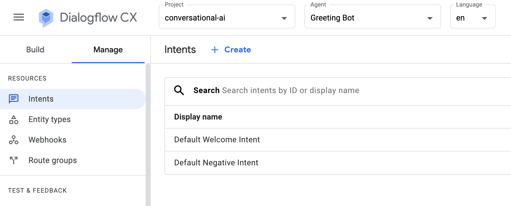
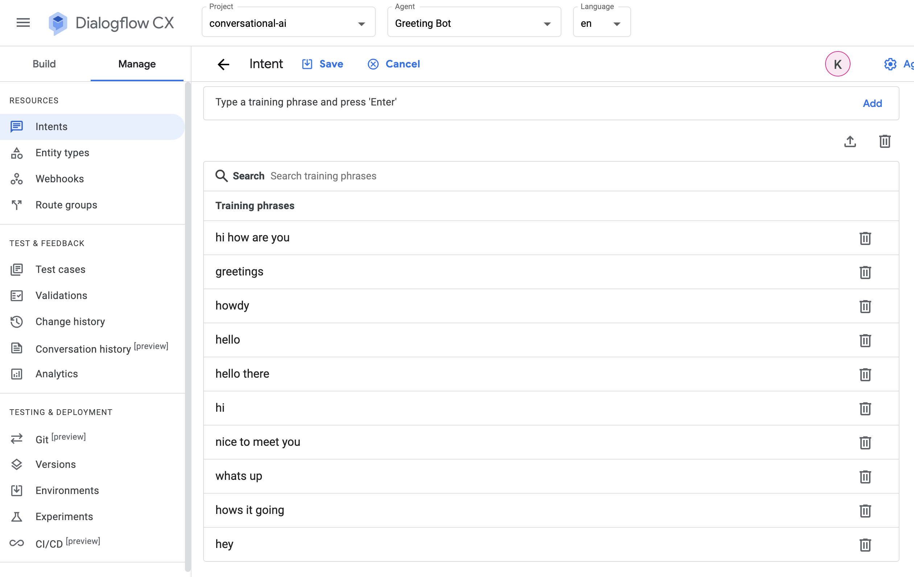

# Using Terraform with REST API calls to Dialogflow

Use Terraform to templatize REST API calls to Dialogflow in Google Cloud.

Uses a REST API call invoked from Terraform to modify the training phrases in
the default welcome intent.

# Prerequisites

* Register for a Google Cloud account (https://cloud.google.com/docs/get-started)
* Enable the Dialogflow API (https://cloud.google.com/dialogflow/cx/docs/quick/setup)
* Install and initialize the Google Cloud `gcloud` CLI tool (https://cloud.google.com/sdk/docs/install)
* Install Terraform (https://developer.hashicorp.com/terraform/downloads)

# Usage

1. Clone this repository and `cd` into the `terraform/` directory
1. Edit the values in `variables.tf`
1. Run `terraform init`
1. Run `terraform apply`
